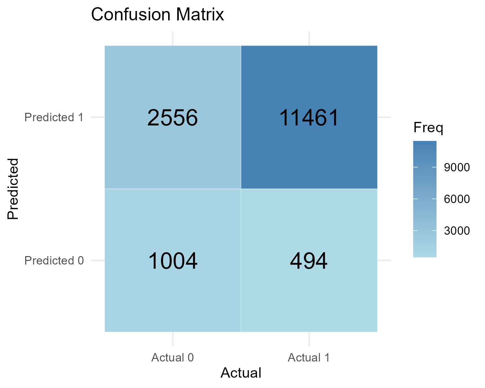

```{r setup, include=FALSE}
# Default for chunk options 
knitr::opts_chunk$set( message = FALSE, warning = FALSE, 
                       results =FALSE, echo = TRUE)

```


# Integrating household survey and geospatial data

We focus here on SDG 5.3.1, which measures the *proportion of women aged 20–24 years who were married or in a union before age 15 and before age 18*. We aim to explore both the methodological steps needed to compute this indicator and how to enhance its analysis by integrating additional sources of information, in particular environmental factors. 

A key objective is to show the practical aspects of calculating the SDG 5.3.1 indicator using survey data. But while social and economic factors are widely recognized in shaping early marriage patterns, we propose a new lens for analysis: the environment. 

> Could environmental factors such as drought episode, levels of aridity, or degrees of urbanization play a role in child marriage?

By combining data from survey and geospatial sources, we showcase the importance of multi-dimensional drivers of child marriage and provide tools to examine them through a data-driven approach.

## Data and tools 

We need a minimum of packages to handle different types of data - Survey data (DHS),environmental data (geospatial data) - and for the analysis (modeling) and visualization (maps)

```{r packages}
# GIS packages
library(raster) ## for reading "RASTER" files
library(sf)     ## For reading shapefiles
library(sp)     ## for adjusting CRS in 

# Load the packages for reading data
library(survey)
library(haven)    # For reading DHS datasets

# Tidy data management packages
library(dplyr)
library(data.table)

# Plotting packages
library(ggplot2)
library(RColorBrewer)
library(ggcorrplot)

# Nice presentation of results
library(knitr)
library(papeR)
library(data.table)
library(modelsummary)
```


## The DHS survey data

We load and prepare the Demographic and Health Survey (DHS) data and define child marriage, in line with SDG indicator 5.3.1.


```{r}
## ----Read DHS Data ---
# Load DHS women individual record dataset
DHS_raw <- read_sav("Data/BDIR72SV/BDIR72FL.SAV")
```

We have **`r nrow(DHS_raw)`** observations (households) in the DHS file we are analysisng for Bangladesh. Since the DHS data contains  **`r ncol(DHS_raw)`** variables (columns), we begin by selecting a few key variables.  
We also scale the survey weights and recode some explanatory variables (e.g., education level) to facilitate further analysis. Here is a summary of the data, including a count of missing (if any). 

```{r}
# Select relevant variables
ivar_name <- c("CASEID", "V001", "V002", "V003", "V005", "V012", "V015", "V021", "V022", "V106", "V119",  "V511")

DHS_data <- DHS_raw %>%
  dplyr::select(ivar_name)

# Create new variables ( Child marriage, Scale weights, ..)
DHS_data <- DHS_data %>%
mutate(       married_before_18 = as.factor(ifelse(V511 < 18, 1, 0)), # Create binary indicator for child marriage
              wt = V005 / 1000000)                     # Scale weights
       

# Renaming explanatory variables
DHS_data <- DHS_data %>%                   
  mutate(Age = V012, 
         Education = factor(V106,
                            levels = c(0, 1, 2, 3),
                            labels = c("No education", "Primary", "Secondary", "Higher")),
         
          Electricity = factor(V119, 
                               levels = c(0, 1),
                              labels = c("No", "Yes"))
  )
```


```{r echo=FALSE, results=TRUE}
DHS_data %>% datasummary_skim()

```


# Computing child marriage rate at cluster level


We first define the population under scrutiny (women aged 20-24), and compute child marriage rate by cluster. The indicator is based on a numerator and denominator

-  Numerator  = *Nb of women aged 20-24 who where married or in a union before the age of 15 of before age 18*
-  Denominator = *Nb of women aged 20-24 in the population*

The rate is then simply:
$$
 Rate  = \frac{numerator}{denominator} \times 100
$$
But to compute that rate, one must integrate the weight `wt` of each individual in the computation.  
```{r}
# Filter women aged 20-24
DHS_data_filtered <- subset(DHS_data, V012 >= 20 & V012 < 25)

# Calculate child marriage rate by cluster
cluster_rate <- aggregate(
  cbind(numerator = ifelse(married_before_18 ==1, wt, 0), denominator = wt) ~ V001, 
  data = DHS_data_filtered, 
  FUN = sum, na.rm = TRUE
)
# Add child marriage rate to the summary table
cluster_rate<- cluster_rate %>%
  mutate(child_marriage_rate = numerator / denominator)

# Median value
median_rate <- round(median(cluster_rate$child_marriage_rate), 4) *100
```
When computing the child marriage rate for each of the*`r nrow(cluster_rate)`*  cluster, we can see some disparities. Overall the median value is  value is **`r median_rate``** \%.


```{r echo=FALSE, results=TRUE}


# Rename the first column to "DHSCLUST"
colnames(cluster_rate)[1] <- "DHSCLUST"


datasummary_skim(select(cluster_rate, -c("DHSCLUST")), 
                 title = "Child marriage rate by cluster",
                 digit =2, 
                notes = paste("N =", nrow(cluster_summary)) )

```

### Integrating spatial component at the cluster level

We integrate geospatial data with survey-based child marriage estimates to explore the potential influence of environmental factors. We begin by loading geovariate data (*e.g.*, aridity, population, etc.) and DHS cluster shapefiles, then merge these with child marriage rates at the cluster level. 

```{r}
# Load geospatial covariate data
geo_covariate <- read.csv("Data/BDGC72FL.csv")

# Load DHS cluster shapefile
DHS_Cam <- read_sf("Data/BDGE71FL/BDGE71FL.shp")

# Merge DHS survey data and geocovariate data
merged_df <- merge(DHS_Cam, geo_covariate, by = "DHSCLUST")

# Merge child marriage data with the spatial data
merged_df <- merge(merged_df, cluster_rate, by = "DHSCLUST")

# Remove rows with invalid longitude values
geo_cam <- subset(merged_df, LONGNUM != 0)
```

Once again we have a large data set with **`r ncol(geo_cam)`** variables at the cluster level. Here is a quick description of the variables at hand. Most variables are avaialble for several years. We will focus here only on the most recent ones for the year 2015.

```{r echo=FALSE, results=TRUE}
# Let's explore specific variables. 

Mygeovariables <- c("Drought_Episodes", "Global_Human_Footprint", "Irrigation",
                    names(select(geo_cam, ends_with("2015")) ))

datasummary_skim(select(geo_cam, Mygeovariables), 
                 title = "Child marriage rate by cluster",
                 digit =2, 
                notes = paste("N =", nrow(cluster_summary)) )

```

> Some cleaning, and choices on the variables to pick is needed

We need to do  basic data cleaning and ensure that all spatial layers use a common coordinate reference system (CRS) to allow accurate spatial analysis and mapping.
Also, we can observe some minimal values at **-9999** that are not correct. 

```{r}
geo_cam$Aridity_2015[geo_cam$Aridity_2015 < 0] <- NA
```

# Child marriage and aridity

We will here only use *Aridity*. Later in the analysis, we will select more variables to capture the multi-dimensional aspect of child marriage.

```{r}
# Load Bangladesh administrative boundary shapefile
boundary <- read_sf("Data/gadm41_BGD_shp/gadm41_BGD_2.shp")

## ----Check CRS and Transform if Needed-------------------------------------------------------------------------------
# Ensure CRS compatibility
st_crs(boundary) <- 4326  # Set CRS to WGS 84 if not already
st_crs(geo_cam) <- 4326   # Ensure geo_cam has the same CRS
```

## Visualizing clusters with highest child marriage rate

```{r}
Mythreshold <- 0.75
```

We can extract the clusters with a  child marriage rate above `r Mythreshold*100` \% . 

```{r}
## ----Calculate Top 10% Child Marriage Clusters-----------------------------------------------------------------------
# Calculate the percentile of child marriage rates (based on Mythreshold)
threshold_marriage <- quantile(geo_cam$child_marriage_rate, Mythreshold, na.rm = TRUE)

# Also, the top 25 cluster..
top_25_clusters <- subset(geo_cam, child_marriage_rate > threshold_marriage)

```


```{r}
## ----Plot Child Marriage and Aridity on a Single Map-----------------------------------------------------------------
# Create the enhanced map
overlay_map <- ggplot() +
  # Plot administrative boundaries
  geom_sf(data = boundary, fill = "white", color = "grey", linewidth = 0.2) +
  
  # Plot aridity values as background points
  geom_point(data = geo_cam, 
             aes(x = LONGNUM, y = LATNUM, color = Aridity_2015), 
             size = 5) +
  scale_color_gradient(low = "white", high = "#ec6930", name = "Aridity 2015") +
  scale_alpha_continuous(range=c(0.3,1)) +
  
  # Plot top 10% child marriage clusters with distinct styling
  geom_point(data = subset(geo_cam, child_marriage_rate > threshold_marriage), 
             aes(x = LONGNUM, y = LATNUM), 
             size = 1.5, shape = 21, fill = "black", color = "black", stroke = 1.5) +
  
  # Customize the theme for a clean appearance
  ggtitle(label = "Aridity Map of Bangladesh with high mariage rate clusters ", 
          subtitle = paste("Clusters with a child marriage rate above", Mythreshold, "are represented (black dots)")) +
  theme_void() +
  coord_sf()

# Plot the final enhanced map
plot(overlay_map)

```


# Multi-dimensional approach 


## Data preparation 

For a detailed analysis at the individual level (DHS is micro data) we have to merge DHS data and envrionment data at the cluster level using the location of each household. 

```{r}
# Merge DHS with environmental variables
DHS_Full <- merge(DHS_data , geo_covariate, by.x ="V001", by.y=c("DHSCLUST"), all.x=T) 

```


```{r}
# Aridity has some negative values (-9999)
 DHS_Full <- DHS_Full %>%
  mutate(Aridity = ifelse(Aridity_2015 < 0, NA, Aridity_2015)  )
```

As we have seen, we can integrate environmental variables since our auxiliary environmental data set contains  **`r ncol(geo_covariate)`**  variables. We will select here a few variables that seem to be relevant and not too correlated. 

```{r}
# Defining the variables of the model
Y<-"married_before_18"               # Response variable
XCovars <- c("Age", "Education", "Electricity" ,  "Aridity") 
ZCovars <- c("Drought_Episodes",  "UN_Population_Density_2015",  "SMOD_Population_2015") 


```


```{r }
# Drop geometry column (important if geo_cam is an sf object)
geo_cam_df <- st_drop_geometry(geo_cam)

# Keep only relevant and complete variables 
existing_vars <- Mygeovariables[Mygeovariables %in% names(geo_cam_df)]
 

corr_data <- geo_cam_df %>%
  select(all_of(existing_vars))%>%
  select(!starts_with("Mal") & !starts_with("All")) %>%
  select(1:8, starts_with("UN"), starts_with("SMOD")) %>%
  mutate(across(everything(), as.numeric))

# We compute the correlation matrix of the covariates
corr_coef <- cor(corr_data, use = "p")

#And then plot it with nice options 
ggcorrplot(corr_coef, 
           title = "Correlation of some environmental variables available",
           type = "lower",         # lower triangle of the matrix only
           hc.order = TRUE,        # variable sorted from highest to lowest
           outline.col = "white",  #Color options
           lab = TRUE)

```

In this analysis, we will use: 

- `r XCovars`  as classical socio-demographic variables and 
- `r ZCovars`  as  environmental variables to include in the model.  


> Finaly, the formula of our model is: 

```{r , results=TRUE}
formula_string<- paste(Y, paste(c(XCovars, ZCovars), collapse=" + "), sep="~")
print(paste(" Regression formula: ",formula_string))

```

## Logistic model. 

To estimate the likelihood of child marriage, we use a logistic regression model. Since the dependent variable is binary (married before age 18 or not), we use the log of odd ratios (*log-odds*) of the event using a generalized linear model.

The logistic regression model takes the form:
$$
\log\left( \frac{p}{1 - p} \right) = \beta_0 + \beta_1 X_1 + \beta_2 X_2 + \cdots + \beta_k X_k
$$
Where:

- p is the is the probability of being married before age 18
- $\beta_0$ is the intercept 
- $\beta_i$ are the coefficients for the explanatory variables $X_i$

This allows us to quantify the impact of demographic, socioeconomic, and environmental variables on the likelihood of child marriage.


```{r, results='asis'}
# Logistics Regression with the DHS structure

glm.simple.fit <- glm(formula_string, 
               data = DHS_Full,
               family = binomial)


# Nice printing of the results (using paper and knitr packages)
pretty_lm2 <- prettify(summary(glm.simple.fit))
kable(pretty_lm2, digits = 3)

```


### Common mistake

> But, wait! We need to take into account the specific structure of the DHS survey. 

Since we have a survey, and thus each observation is weighted according to specific scheme, we must use that feature in our model. The correct results are thus the following. In principle, there should not be too much difference withe the unweighted model. 

```{r}
# Convert to correct types
DHS_FULL_Strat <- DHS_Full %>%
         mutate(V003 <- as.factor(V003))
         
# Create the survey design object
DHSdesign <- svydesign(id = ~V001,               # Cluster (PSU)
                    strata = ~V003,           # Stratification
                    weights = ~wt,
                    data = DHS_FULL_Strat, 
                    nest = TRUE)
```

```{r, results='asis'}
# Logistics Regression with the DHS structure
glm.fit.strat <- svyglm(formula_string, 
               data = DHS_FULL_Strat,
               design = DHSdesign, 
               family = binomial)


# Nice printing of the results (using paper and knitr packages)
pretty_lm2 <- prettify(summary(glm.fit.strat))
kable(pretty_lm2, digits = 3)

```


### Confusion Matrix and other criterias

To asses the quality of our estimation, one can check whether the model predicts well the observations by examining the confusion matrix that counts observations predicted *vs* observed. 


```{r, results=TRUE }
library("regclass")
cm <- confusion_matrix(glm.fit.strat)
t(cm)
```

We can also check different numerical indicators based on the confusion matrix. 
Recalling that: 

```{r, out.width = "400px", results= TRUE}

```

We can check several important indicators:

- ***Accuracy***: (TP + TN) / (TP + TN + FP + FN) $\leftarrow$ This is global rate of performance
- ***Specificity*** : TP / (TP + FP) $\leftarrow$ proportion of positive predictions that are correct.
- ***Sensitivity*** (or *recall*): TP / (TP + FN) $\leftarrow$ proportion of actual positives that are correctly predicted.
- ***F1 score***: combines Specificity and sensitivity:
$$
F1\_score = \frac{2 \times Specificity \times Sensitivity}{ Specificity + Sensitivity}
$$ 


```{r}
# Computing elements from the confusision matrix

TP <- as.numeric(cm[2, 2])  # True Positives
TN <- as.numeric(cm[1, 1])  # True Negatives
FP <- as.numeric(cm[1, 2])  # False Positives
FN <- as.numeric(cm[2, 1])  # False Negatives

# Calculate accuracy
accuracy <- (TP + TN) / (TP+TN+FP+FN)

# Calculate specificity
specificity <- TP / (TP + FP)

# Calculate sensitivity
sensitivity <- TP / (TP + FN)

# Calculate F1-score
f1_score <- 2 * (specificity * sensitivity) / (specificity + sensitivity)
```

Here, we have for our logit model : 

- **Accuracy** = *`r  round(accuracy, 3)`*
- **Specificity** =  *`r round(specificity,3)`*
- **Sensitivity** = *`r  round(sensitivity,3)`*
- **F1_score** = *`r round(f1_score,3)`*

> The accuracy of our model is  `r  round(accuracy*100, 1)` \%

## Visual representation of the logistic model

To better understand the relationship between child marriage and key covariates, we can use a plot of the predicted probability of being married before age 18 as a function of four variables: age, education level, aridity, and population density. 
These **marginal effects** are directly derived from the logistic regression model.  We can then interpret the (marginal) effect on the probability of child marriage due to variation of each variable, with all other variables held constant. 


```{r }
library(visreg)
library(ggpubr)

# Probabilities of married before 15 wrt 
p.age <- visreg(glm.fit.strat, "Age", scale="response", rug=0,  # for rugs =2
       xlab="Age",
       ylab="P(Before15=1)", gg=TRUE) + 
  ylim(0,1) +theme_minimal()

p.education <- visreg(glm.fit.strat, "Education", scale="response", rug=0,
       xlab="Education",
       ylab="P(Before15=1)", gg=TRUE) + 
  ylim(0,1) + theme_minimal() + 
 theme(axis.text.x = element_text(angle = 45,
                                   vjust = 1,
                                   hjust=1,
                                   size=7))


p.aridity <- visreg(glm.fit.strat, "Aridity", scale="response", rug=0,
       xlab="Aridity level (2015)",
       ylab="P(Before15=1)", gg=TRUE) + 
  ylim(0,1) +theme_minimal()

p.income <- visreg(glm.fit.strat, "UN_Population_Density_2015", scale="response", rug=0,
       xlab=" Population Density (2015)",
       ylab="P(Before15=1)", gg=TRUE) + 
  ylim(0,1) +theme_minimal()


figure <- ggarrange( p.age, p.education, p.aridity, p.income,
                    #labels = c("Edudation", "Age",  "Aridity (2015)", ""),
                    ncol = 2, nrow = 2)
figure
```


# Conclusion

In this analysis we tested the hypothese that  environmental factors such as drought episode, levels of aridity, or degrees of urbanization could play a role in child marriage. 

By combining data from survey and geospatial sources, we showcase the importance of multi-dimensional drivers of child marriage and provide tools to examine them through a data-driven approach. We provide a  cluster-level exploration of child marriage, revealing a visible spatial correlation between high child marriage rates and aridity and a map of Bangladesh. 

This initial geospatial insight provided the motivation for a multivariate approach taking into account not only socio-economic factoirs, but also environmental factors. We use a modelling based on a logistic regression and results confirmed that, alongside well-established socio-economic drivers like education, environmental factors such as aridity levels are also associated with the likelihood of child marriage. 

These findings suggest that effective policy responses should integrate both social and environmental dimensions to address child marriage.


```{r include=FALSE}
knitr::knit_exit()
```


# Random Forests  
 
 
```{r RF, cache = TRUE}
set.seed(2512)    # set random seed so we can reproduce the result

ZCovarsRF <- c("Drought_Episodes",  names(DHS_Full %>% select(ends_with("2015")))) 

formula_rf <- paste(Y, paste(c(XCovars, ZCovarsRF), collapse=" + "), sep="~")
print(paste(" Regression formula: ",formula_rf))
```


```{r , cache = TRUE}
myRandomForest<-randomForest(as.formula(formula_rf),
                             data = DHS_Full,
                             importance = TRUE,
                             maxnodes=25, 
                             mtry = 5, 
                             ntree=500,
                             type="classification",
                             na.action = na.roughfix)
```

## Accuracy rate and confusion Matrix 

```{r, results = TRUE}
myRandomForest

```
#### 
```{r}
cm.rf <- myRandomForest$confusion
print(cm.rf)
```
```{r}
# Computing elements from the confusision matrix

TP <- as.numeric(cm.rf[2, 2])  # True Positives
TN <- as.numeric(cm.rf[1, 1])  # True Negatives
FP <- as.numeric(cm.rf[1, 2])  # False Positives
FN <- as.numeric(cm.rf[2, 1])  # False Negatives

# Calculate accuracy
accuracy <- (TP + TN) / (TP+TN+FP+FN)

# Calculate specificity
specificity <- TP / (TP + FP)

# Calculate sensitivity
sensitivity <- TP / (TP + FN)

# Calculate F1-score
f1_score <- 2 * (specificity * sensitivity) / (specificity + sensitivity)
```

## Results for RF

```{r}
# Output the results
paste("accuracy RF =", round(accuracy, 3))
paste("specificity RF = ", round(specificity,3))
paste("sensitivity RF =", round(sensitivity,3)) 
paste("f1_score RF =",  round(f1_score,3))
```

Here, we have for the RF model : 

- `r paste("accuracy for RF =", round(accuracy, 3))`
- `r paste("specificity for RF = ", round(specificity,3))`
- `r paste("sensitivity for RF =", round(sensitivity,3))`
- `r paste("f1_score for RF =",  round(f1_score,3))`

## Variable importance plot 

```{r}
varImpPlot(myRandomForest)
```


